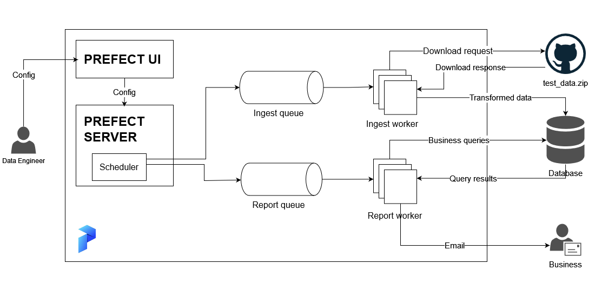
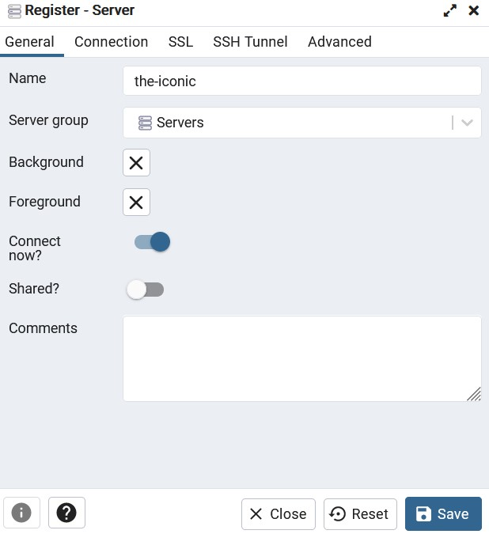
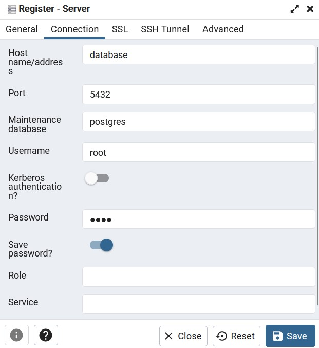
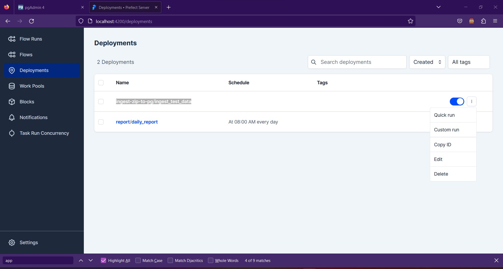
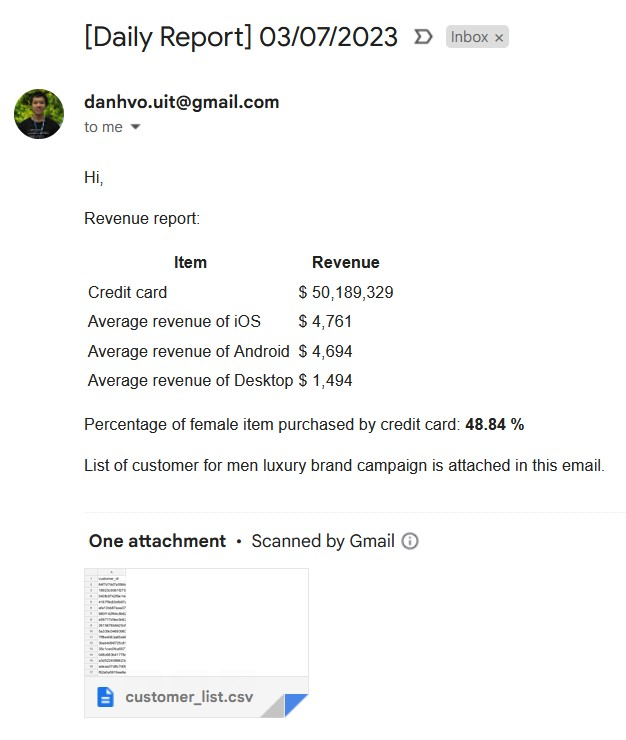
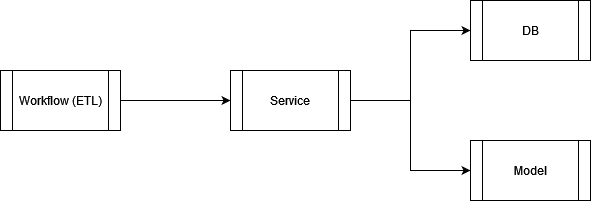

# The ICONIC challenge

## Overview
This is the challange project from **The ICONIC**. The main functionality of this project is to perform 2 data workflows:

- Ingest test_data.zip into database (Postgres).
- Perform business queries and send a report email every day.



Technologies and languages used in this project:

- **Programming languages**: Python, Bash
- **Containerization**: Docker
- **Workflow orchestrator**: Prefect
- **Database**: Postgres


## Prerequisite
Docker with compose plugin (current version: 20.10.17).

## Instruction
To build the system:
```
docker compose build
```

To bring the system up:
```
docker compose up -d
```

**Note**: If the system starts at the first time, the database has nothing. So, we need to create tables and insert some initial records. To do that, refer to the below instructions:

1. Open PgAdmin with URL `http://localhost:8000/` and login with username `danhvo.uit@gmail.com` and password `root`.
2. Register a new server in PgAdmin with following configurations:


3. Access to **the-iconic** database and perform all `*.sql` files in `src/iconic/model/migrate` path.
4. Insert the Google Mail credential:
```
INSERT INTO resource (resource_name, resource_password)
VALUES ('your_email@gmail.com', 'your_email_app_password')
```
5. Access Prefect Deployment UI: `http://localhost:4200/deployments` and perform quick run the `ingest-zip-to-pg/ingest_test_data` deloyment to download and ingest [test_data.zip](https://github.com/theiconic/technical-challenges/raw/master/data/sample-data/test_data.zip) to Postgres database:

6. After the `ingest-zip-to-pg/ingest_test_data` workflow finish, we perform quick run the `report/daily_report` deployment also to query and send report email. The email should look like as below:

7. All things are in shape now!

---
## Tackle the challenge

### Stage 1: CLEAN

**Step 1**: Download and extract [test_data.zip](https://github.com/theiconic/technical-challenges/raw/master/data/sample-data/test_data.zip) with the lowercase SHA-256 hashed password:
```
from hashlib import sha256
password = 'welcometotheiconic'
encrypted_password = sha256(password.encode('utf-8')).hexdigest()
```

**Step 2**: Pass the `encrypted_password` from step 1 to `zip_file` object and perform extract its member (`data.json`). Refer to [extract_zip_resource](https://github.com/datavadoz/the-iconic/blob/aaef440068dd27e02d400a7fdfed6397387975f3/src/iconic/service/resource.py#L45) method for more details.

**Step 3**: Transform `data.json` content from newline delimited (`\n`) JSON format to comma delimited (`,`) JSON format. For example:

*From:*
```
JSON_1\nJSON_2\n
```

*To:*
```
[JSON_1,JSON_2]
```
Belowing code snippet addresses that problem:
```
with open(data_json_file_path, 'r') as f:
    lines = f.readlines()

# Remove EOL. Then, put comma at the end of each line, except the last line
rows = [f'{line[:-1]},' for line in lines]
rows[-1] = rows[-1][:-1]
# Enclose all comma-separated json object by brackets
json_str = '[' + ''.join(rows) + ']'
```
**Step 4**: Transform `json_str` from step 3 to pandas data frame and have a look on it:
```
df = pd.read_json(json_str)
df.info()

<class 'pandas.core.frame.DataFrame'>
RangeIndex: 46279 entries, 0 to 46278
Data columns (total 43 columns):
 #   Column                    Non-Null Count  Dtype
---  ------                    --------------  -----
 0   sacc_items                46279 non-null  int64
 1   work_orders               46279 non-null  int64
 2   female_items              46279 non-null  int64
 3   is_newsletter_subscriber  46279 non-null  object
 4   male_items                46279 non-null  int64
 5   afterpay_payments         46279 non-null  int64
 6   msite_orders              46279 non-null  int64
 7   wftw_items                46279 non-null  int64
 8   mapp_items                46279 non-null  int64
 9   orders                    46279 non-null  int64
 10  cc_payments               46279 non-null  int64
 11  curvy_items               46279 non-null  int64
 12  paypal_payments           46279 non-null  int64
 13  macc_items                46279 non-null  int64
 14  cancels                   46279 non-null  int64
 15  revenue                   46279 non-null  float64
 16  returns                   46279 non-null  int64
 17  other_collection_orders   46279 non-null  int64
 18  parcelpoint_orders        46279 non-null  int64
 19  customer_id               46279 non-null  object
 20  android_orders            46279 non-null  int64
 21  days_since_last_order     46279 non-null  int64
 22  vouchers                  46279 non-null  int64
 23  average_discount_used     46279 non-null  float64
 24  shipping_addresses        46279 non-null  int64
 25  redpen_discount_used      46279 non-null  float64
 26  mftw_items                46279 non-null  int64
 27  days_since_first_order    46279 non-null  int64
 28  unisex_items              46279 non-null  int64
 29  home_orders               46279 non-null  int64
 30  coupon_discount_applied   36074 non-null  float64
 31  desktop_orders            46279 non-null  int64
 32  ios_orders                46279 non-null  int64
 33  apple_payments            46279 non-null  int64
 34  wspt_items                46279 non-null  int64
 35  wacc_items                46279 non-null  int64
 36  items                     46279 non-null  int64
 37  mspt_items                46279 non-null  int64
 38  devices                   46279 non-null  int64
 39  different_addresses       46279 non-null  int64
 40  wapp_items                46279 non-null  int64
 41  other_device_orders       46279 non-null  int64
 42  average_discount_onoffer  46279 non-null  float64
```

**Step 5**: Perform data cleansing. We must align the data frame with the predefined [data catalog](https://github.com/theiconic/technical-challenges/tree/master/data/data-engineer#data). There are 3 things to be considered:

- The number of rows is different from the data catalog (43 vs 41).
- The `customer_id` column should be unique.
- From the data catalog, there are 2 string columns (`customer_id`, `is_newsletter_subscriber`), 3 float columns (`average_discount_onoffer`, `average_discount_used`, `revenue`) and the others are integer.

To address them, we should:

- Define a data model (data schema) based on the data catalog. Then, use this data schema to align the data type of the data frame. We named it `customer_payment`.
- Remove 2 redundent columns: `redpen_discount_used` and `coupon_discount_applied`.
- Remove duplicated rows.

As a result, we have a clean data frame and ready to load it into database.

### Stage 2: INGEST

**Step 1**: Create a `customer_payment` table via [0002_customer_payment.sql](https://github.com/datavadoz/the-iconic/blob/main/src/iconic/model/migrate/0002_customer_payment.sql). This table definition must be aligned with the data catalog.

**Step 2**: Use `sqlalchemy` library to upsert Pandas data frame into Postgres.

**Step 3**: Verify the ingestion phase is successful by `SELECT COUNT(*) FROM customer_payment` statement.

### Stage 3: ANALYSE
**Question 1**: What was the total revenue to the nearest dollar for customers who have paid by credit card?
```
SELECT ROUND(SUM(revenue)) AS credit_card_revenue
FROM customer_payment
WHERE cc_payments <> 0
```

**Question 2**: What percentage of customers who have purchased female items have paid by credit card?
```
SELECT COUNT(*) / (SELECT COUNT(*) FROM customer_payment)::float * 100 AS percentage
FROM customer_payment
WHERE cc_payments <> 0 AND female_items <> 0
```

**Question 3**: What was the average revenue for customers who used either iOS, Android or Desktop?
```
WITH _avg_revenue_ios_customer AS (
	SELECT 'ios' AS platform, ROUND(AVG(revenue)) AS avg_revenue
	FROM customer_payment
	WHERE ios_orders <> 0
), _avg_revenue_android_customer AS (
	SELECT 'android' AS platform, ROUND(AVG(revenue)) AS avg_revenue
	FROM customer_payment
	WHERE android_orders <> 0
), _avg_revenue_desktop_customer AS (
	SELECT 'desktop' AS platform, ROUND(AVG(revenue)) AS avg_revenue
	FROM customer_payment
	WHERE desktop_orders <> 0
)

SELECT *
FROM (SELECT * FROM _avg_revenue_ios_customer) AS ios
UNION (SELECT * FROM _avg_revenue_android_customer)
UNION (SELECT * FROM _avg_revenue_desktop_customer)
```

**Question 4**. We want to run an email campaign promoting a new mens luxury brand. Can you provide a list of customers we should send to?
```
SELECT customer_id
FROM customer_payment
WHERE male_items <> 0
```

### Stage 4: PRODUCTIONISATION

To run the above queries daily, we need:

**1. The code base**

After finishing the implementation of 2 main functionalities, the code base should be modularized into several parts to make it reusable, extensible and maintainable:

- **db**: Take responsibilty of database handling (i.e: database session, query, upsert,...)
- **model**: A place to store data model.
- **service**: Each service should handle only one domain.
- **workflow**: ETL pipeline.



*Note*: One module can only interact with the adjacent module. For instance, `Workflow` can use `Service` directly. But it does not allow to use of `DB` or `Model` from `Workflow` directly.

**2. Database**

We should choose a relation database because we know the data structure that can be organized data in tables. Postgres is a good one.

**3. Scheduler**

Technically, we can use `crontab` that is provided by Linux to call workflow at a particular time (every day in this case). But it is hard to deploy and manage when the project is enlarged. We need workflow orchestration to play this role. Even though there are several famous ETL tools out there (Airflow, Dagster, Pentaho,...), Prefect is the chosen one for this project because of the following reasons:

- Light and easy to install.
- Easy to scale workers horizontally.
- Elegantly write ETL pipelines.
- Simple pipline deployment.
- Simple and intuitive GUI.
- Nice logging.

**4. Notification**

To inform the query result to stakeholders, we need to send an email after the corresponding workflow finishes successfully.

**5. Nice to have**

We can consider using a container orchestration tool (Swarm, Kubernetes) to scale the workers when the system handles numerous heavy requests.
